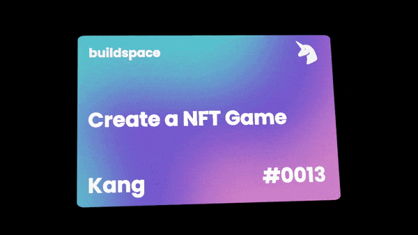

# Buildspace NFT Game Project

This project is the result of buildspace's [Create your own mini turn-based NFT browser game](https://buildspace.so/p/create-turn-based-nft-game).

It uses hardhat and react.

## NFT

Nice thing about buildspace is wining these awesome NFT's for each project you finish:



You can check it at [OpenSea](https://opensea.io/assets/matic/0x3CD266509D127d0Eac42f4474F57D0526804b44e/19973?force_update=true) as well.

## Game

You mint your character's NFT based on three pre-defined template characters. Then you wait for the monster to appear and attack!

But be careful! The monster's attacks are way more powerful so you need a lot of friends to defeat the terrible monster.

You must have the [Metamask extension](https://metamask.io/download/) on your browser.
Connect to the Rinkeby testnet and have some ([fake ether](https://faucets.chain.link/rinkeby)) to play.

## Live demo

[Capitol Defenders](https://capitol-defenders.herokuapp.com/)

## Development

```
$ git clone https://github.com/brunoscholz/buildspace-nft-game.git ./epic-game

$ cd epic-game
```

Create a .env file and place the following variables:

```
PRIVATE_KEYS="..."
ALCHEMY_API_KEY=...
```

PRIVATE_KEYS is the private key (it can be a comma separated string) to the account you are testing with. You can get this on metamask account details -> expose private key. This will be used by hardhat to deploy the game contract.

ALCHEMY_API_KEY is the secret key of your app. You can create one [here](https://www.alchemy.com/).


#### Install dependencies
```
$ npm install
```

#### Compile

You need to compile the solidity contracts.
After compiling, you need to copy the abi to the react root folder:

```
$ npx hardhat compile
cp artifacts/contracts/MyEpicGame.sol/MyEpicGame.json src/utils/MyEpicGame.json
```

It's ready.

```
$ npm run start
```

Go to [localhost:3000](http://localhost:3000)
